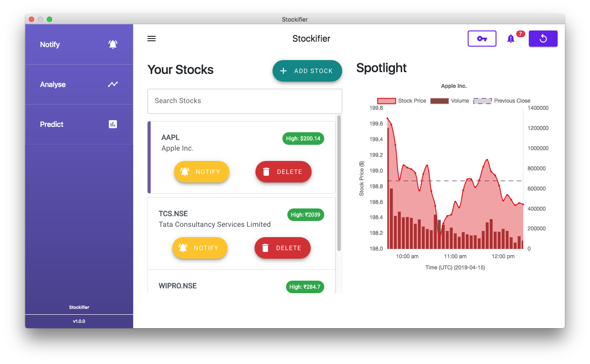
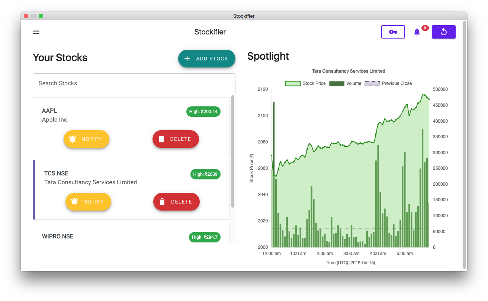
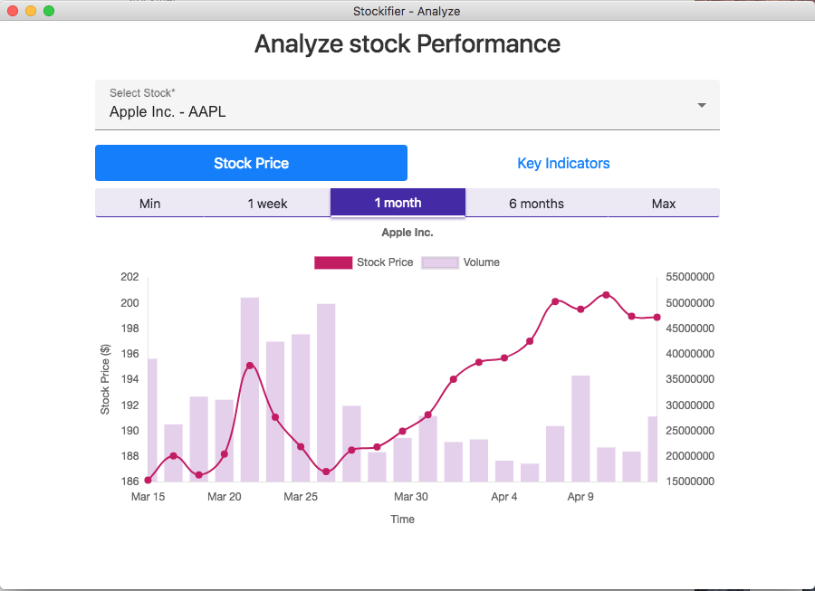
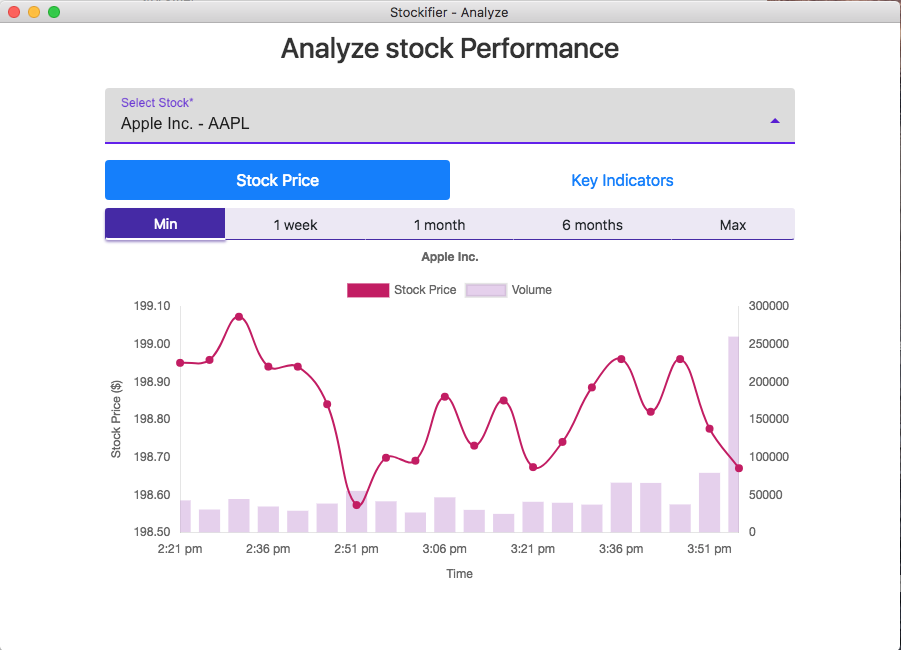
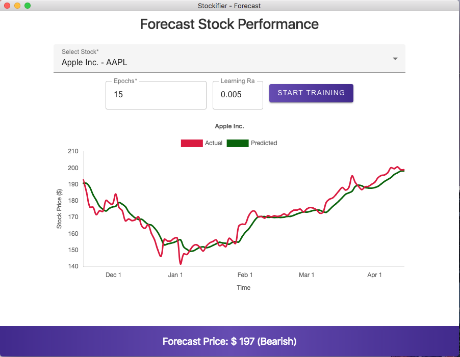
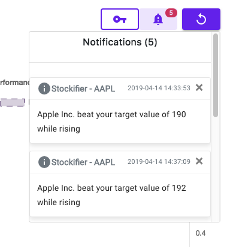
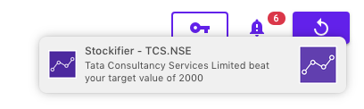
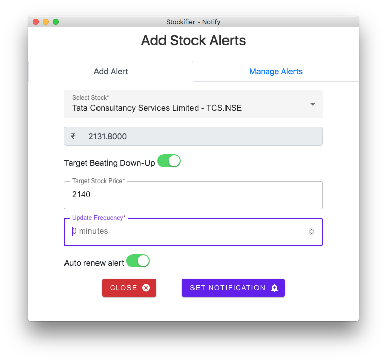
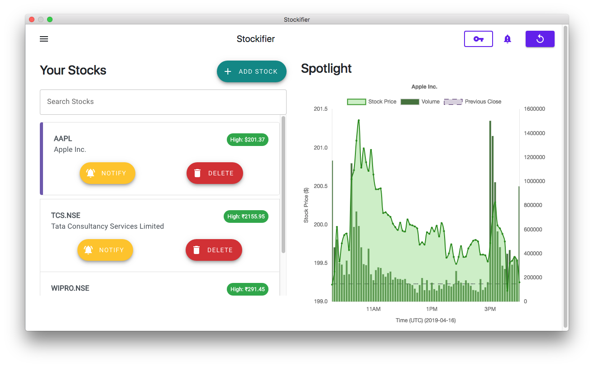

# Stockifier
### A notification and insights app for stock markets

# Downloads

#### Windows Pre Release - [Windows x64](https://github.com/jainsamyak/Stockifier/releases/tag/v1.0.0-beta)

#### Mac OSX Pre Release - [Mac OSX](https://github.com/jainsamyak/Stockifier/releases/tag/v1.0.0-beta)

# Features
* Real time stock alerts and updates through desktop notifications
* Visualization of stock prices and key indicators
* Stock forecasts and predictions through machine learning
* In-built database to store all your monitored stocks

# Screenshots

# Built With
- Electron
- HTML5
- CSS3
- Node.js
- Bootstrap
- Tensorflow JS
  
# Contributing

### Prerequisites:
* Node.js and NPM
* Python 2 (for packaging and distribution)

### Configuring development environment
Once you have cloned/downloaded the repository, issue the `npm install` command in the root directory. This should install all the required packages including Electron.

Once complete, you may issue the `npm start` command to launch the Electron window and start the app.

# Special Mentions

1. [AlphaVantage API](https://www.alphavantage.co/) - [NPM Package](https://www.npmjs.com/package/alphavantage)

2. [TensorFlow JS](https://www.tensorflow.org/js)

# LICENSE
Licensed under MIT. Please view [LICENSE](https://github.com/jainsamyak/Stockifier/blob/master/LICENSE) for more details.

